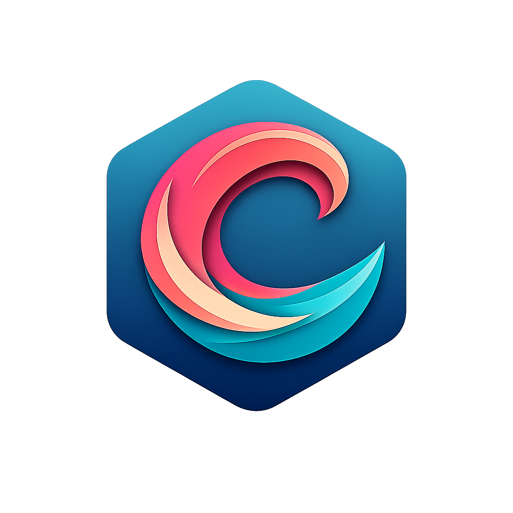

<p align="center">
  
</p>

# Calor
> Coding Agent Language for Optimized Reasoning
<br/>
A programming language designed specifically for AI coding agents, compiling to .NET via C# emission.

## Why Calor Exists

AI coding agents are transforming software development, but they're forced to work with languages designed for humans. This creates a fundamental mismatch:

**AI agents need to understand code semantically** — what it does, what side effects it has, what contracts it upholds — but traditional languages hide this information behind syntax that requires deep semantic analysis to parse.

Calor asks: *What if we designed a language from the ground up for AI agents?*

### The Core Insight

When an AI agent reads code, it needs answers to specific questions:
- What does this function **do**? (not just how it's implemented)
- What are the **side effects**? (I/O, state mutations, network calls)
- What **constraints** must hold? (preconditions, postconditions)
- How do I **precisely reference** this code element across edits?
- Where does this **scope end**?

Traditional languages make agents *infer* these answers through complex analysis. Calor makes them *explicit* in the syntax.

## What Makes Calor Different

| Principle | How Calor Implements It | Agent Benefit |
|-----------|------------------------|---------------|
| **Explicit over implicit** | Effects declared with `§E{cw, fs:r, net:rw}` | Know side effects without reading implementation |
| **Contracts are code** | First-class `§Q` (requires) and `§S` (ensures) | Generate tests from specs, verify correctness |
| **Stable IDs when you want them** | `§F{f001:Main}`, `§L{l001:i:1:100:1}` (IDs are optional) | Precise references that survive refactoring |
| **Indent-based blocks** | Python-style indentation — no closer tags to mismatch | Lower edit cost (~16% fewer tokens in our studies) |
| **Machine-readable semantics** | Lisp-style operators `(+ a b)` | Symbolic manipulation without text parsing |

### Side-by-Side: What Agents See

**Calor** — Everything explicit:
```
§F{Square:pub}
  §I{i32:x}
  §O{i32}
  §Q (>= x 0)
  §S (>= result 0)
  §R (* x x)
```

**C#** — Contracts buried in implementation:
```csharp
public static int Square(int x)
{
    if (!(x >= 0))
        throw new ArgumentException("Precondition failed");
    var result = x * x;
    if (!(result >= 0))
        throw new InvalidOperationException("Postcondition failed");
    return result;
}
```

**What Calor tells the agent directly:**
- Optional ID slot: `§F{f002:Square:pub}` if you need a stable handle for tooling; otherwise just `§F{Square:pub}`
- Precondition (`§Q`): `x >= 0`
- Postcondition (`§S`): `result >= 0`
- No side effects (no `§E` declaration)
- Block ends at dedent — no closer tag to forget

**What C# requires the agent to infer:**
- Parse exception patterns to find contracts
- Understand that lack of I/O calls *probably* means no side effects
- Hope line numbers don't change across edits

## The Tradeoff

Calor deliberately trades token efficiency for semantic explicitness:

```
C#:   return a + b;    // 4 tokens, implicit semantics
Calor: §R (+ a b)       // Explicit Lisp-style operations
```

This tradeoff pays off when:
- Agents need to **reason** about code behavior
- Agents need to **detect** contract violations
- Agents need to **edit** specific code elements precisely
- Code correctness matters more than brevity

### Benchmark Results

Calor shows measurable advantages in AI agent comprehension, error detection, edit precision, and refactoring stability. C# wins on token efficiency, reflecting a fundamental tradeoff: explicit semantics require more tokens but enable better agent reasoning.

[See benchmark methodology and results →](https://juanmicrosoft.github.io/calor/docs/benchmarking/)

## Quick Start

```bash
# Install the compiler
dotnet tool install -g calor

# Initialize for Claude Code (run in a folder with a C# project or solution)
calor init --ai claude

# Initialize for OpenAI Codex CLI
calor init --ai codex

# Initialize for Google Gemini CLI
calor init --ai gemini

# Initialize for GitHub Copilot (with MCP tools)
calor init --ai github

# Compile Calor to C#
calor --input program.calr --output program.g.cs
```

### AI Integration Comparison

| Feature | Claude Code | Gemini CLI | Codex CLI | GitHub Copilot |
|:--------|:------------|:-----------|:----------|:---------------|
| Project instructions | `CLAUDE.md` | `GEMINI.md` | `AGENTS.md` | `copilot-instructions.md` |
| Skill invocation | `/calor` | `@calor` | `$calor` | Reference skill name |
| MCP tools | ✓ (`~/.claude.json`) | ✓ (`.gemini/settings.json`) | ✓ (`.codex/config.toml`) | ✓ (`.vscode/mcp.json`) |
| Enforcement | **Hooks (enforced)** | **Hooks (enforced)** | Guidance + MCP tools | Guidance + MCP tools |

### Your First Calor Program

```
§M{m001:Hello}
  §F{f001:Main:pub}
    §O{void}
    §E{cw}
    §P "Hello from Calor!"
```

Save as `hello.calr`, then:

```bash
calor --input hello.calr --output hello.g.cs
```

### Building from Source

```bash
git clone https://github.com/juanmicrosoft/calor.git
cd calor && dotnet build

# Run the sample
dotnet run --project src/Calor.Compiler -- \
  --input samples/HelloWorld/hello.calr \
  --output samples/HelloWorld/hello.g.cs
dotnet run --project samples/HelloWorld
```

## MCP Tooling

Calor ships an **MCP (Model Context Protocol) server** that gives AI agents direct access to the compiler. Run `calor init --ai <agent>` to auto-configure it, or start it manually:

```bash
calor mcp
```

The server exposes 19 tools across five categories:

| Category | Tools |
|:---------|:------|
| Compilation & Verification | `calor_compile`, `calor_typecheck`, `calor_verify`, `calor_verify_contracts`, `calor_diagnose` |
| Code Navigation (LSP-style) | `calor_goto_definition`, `calor_find_references`, `calor_symbol_info`, `calor_document_outline`, `calor_find_symbol` |
| Analysis & Migration | `calor_analyze`, `calor_assess`, `calor_convert`, `calor_compile_check_compat` |
| Code Quality | `calor_lint`, `calor_format`, `calor_validate_snippet` |
| Syntax Help | `calor_syntax_help`, `calor_syntax_lookup`, `calor_ids` |

See [calor mcp](https://juanmicrosoft.github.io/calor/docs/cli/mcp/) for the complete reference.

## Documentation

- **[Getting Started](https://juanmicrosoft.github.io/calor/docs/getting-started/)** — Installation, hello world, and AI agent integration
  - [Claude Integration](https://juanmicrosoft.github.io/calor/docs/getting-started/claude-integration/) — Enforced Calor-first with hooks
  - [Codex Integration](https://juanmicrosoft.github.io/calor/docs/getting-started/codex-integration/) — OpenAI Codex CLI with MCP
  - [Gemini Integration](https://juanmicrosoft.github.io/calor/docs/getting-started/gemini-integration/) — Google Gemini CLI with hooks and MCP
  - [GitHub Copilot Integration](https://juanmicrosoft.github.io/calor/docs/getting-started/github-integration/) — GitHub Copilot with MCP tools
- **[Syntax Reference](https://juanmicrosoft.github.io/calor/docs/syntax-reference/)** — Complete language reference
- **[CLI Reference](https://juanmicrosoft.github.io/calor/docs/cli/)** — All `calor` commands including `mcp`, `analyze`, `convert`, and `migrate`
- **[Benchmarking](https://juanmicrosoft.github.io/calor/docs/benchmarking/)** — How we measure Calor vs C#

## Contributing

Calor is an experiment in language design for AI agents. We welcome contributions, especially:
- Additional benchmark programs
- Metric refinements
- Parser improvements
- Documentation

See the evaluation framework in `tests/Calor.Evaluation/` for how we measure progress.
