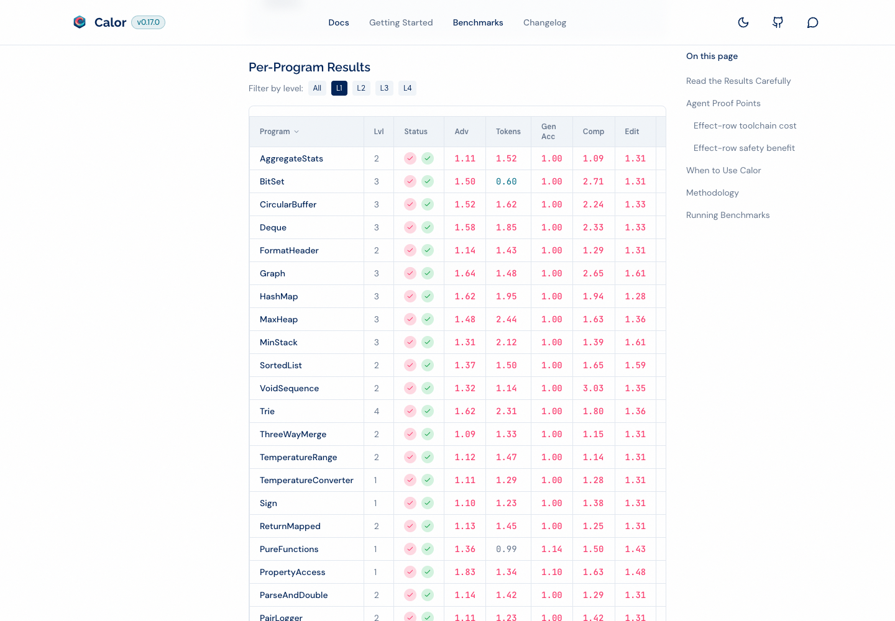
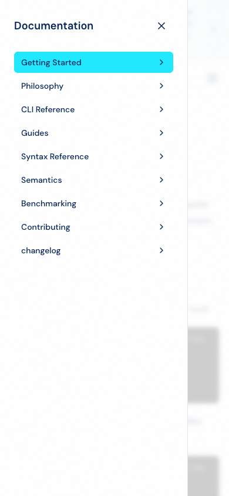
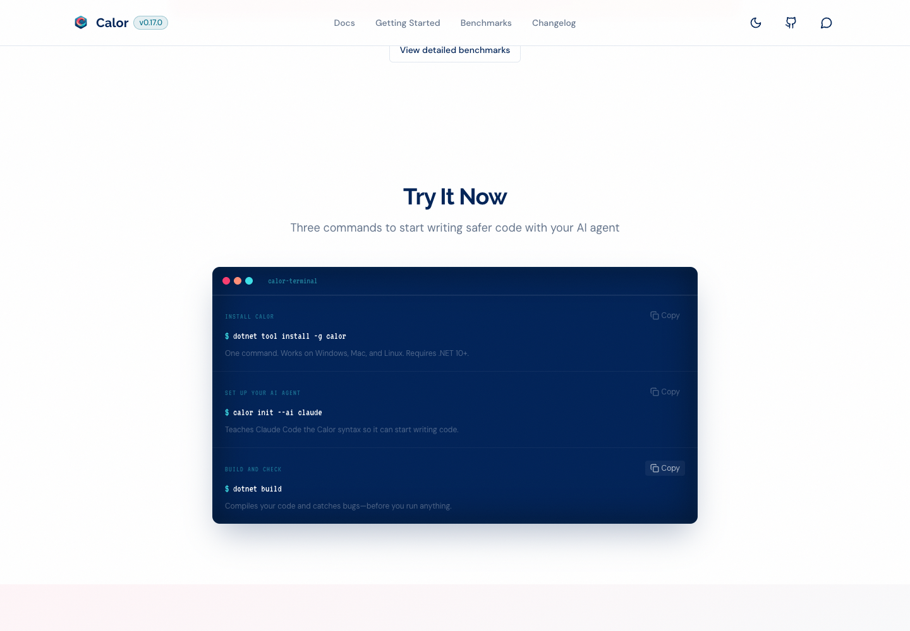
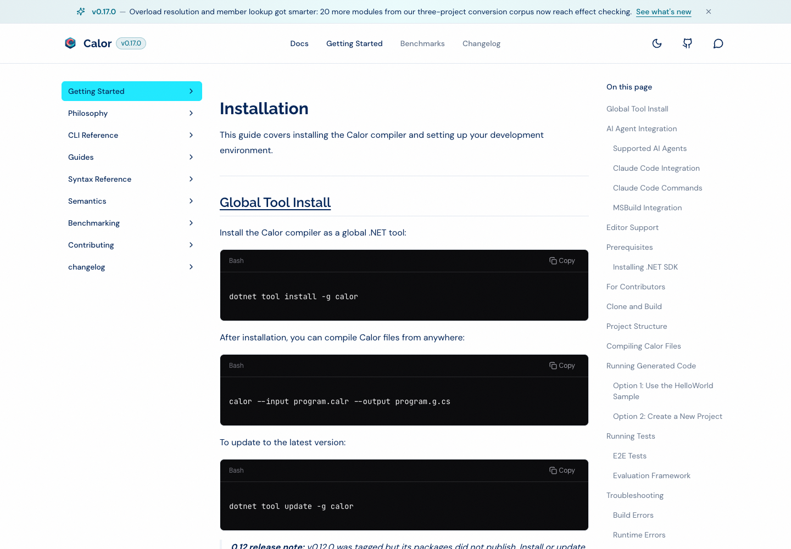
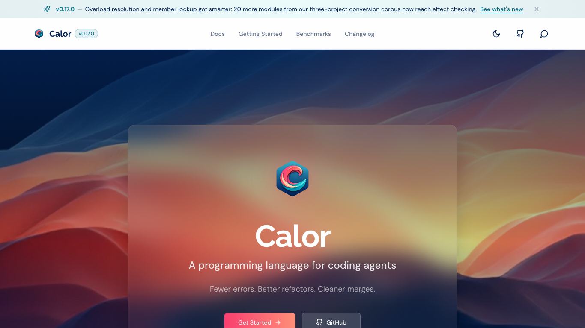

# calor.dev: visual, functional, and content audit

**Date:** September 8, 2026  
**Site:** https://calor.dev/  
**Method:** real Microsoft Edge rendering, screenshots, browser interactions,
keyboard navigation, live DOM/resource inspection, and targeted source review.  
**Source baseline:** `d65cb283b0302216c9e0b8672e967eb33d3eab6c`, compiler 0.17.0.
The deployed site advertises 0.17.0; its exact deployment commit was not established.

## Executive assessment

**Keep the visual identity; improve correctness, accessibility, and the path to
a first successful program before undertaking a redesign.** The navy, cyan, and
coral palette is distinctive, the page hierarchy is understandable, and the site
contains substantial documentation. The main shortcomings are not cosmetic:
the benchmark table displays incorrect rows after interaction, documentation
anchors fail, mobile overlays mishandle keyboard focus, and the literal
Hello World instructions leave the wrong entry point running.

The homepage also spends too much of the first screen on branding instead of
showing what Calor produces and how to try it. A shorter hero, an early code
example, and a complete quickstart would make the existing design more useful.
These are design recommendations, not measured conversion-rate improvements.

### Prioritized findings

P1 means fix first because it affects correctness, successful onboarding, or
basic accessibility. P2 means address next. P3 means worthwhile polish or
discoverability work, not a launch blocker.

| ID | Priority | Finding | Evidence type |
|---|---|---|---|
| W1 | P1 | Benchmark sorting/filtering accumulates incorrect rows | Live reproduction + data/source |
| W2 | P1 | Five Getting Started table-of-contents links do nothing | Live reproduction + source |
| W3 | P1 | Mobile navigation overlays lack essential accessible behavior | Live keyboard/accessible-tree inspection |
| W4 | P1 | Quickstart omits prerequisites; Hello World runs the template instead | Live copy + local compiler reproduction |
| W5 | P1 | Quickstart helper text and Copy controls have insufficient contrast | Computed styles + contrast calculation |
| W6 | P2 | Benchmark page hydration fails outside the server timezone | Controlled live timezone comparison |
| W7 | P2 | Documentation sidebar does not reveal the current subsection | Live desktop/mobile + source |
| W8 | P2 | Theme selection resets on reload and ignores system preference | Live reproduction |
| W9 | P2 | Table sorting is pointer-only; selection states are not exposed | Live controls + source |
| W10 | P2 | Small logo and decorative media impose avoidable transfer cost | Live resource measurements |
| W11 | P2 | Safety claims and release references need better qualification | Live copy + prior compiler audit |
| W12 | P2 | Hero and page length delay the useful explanation and trial | Screenshots + layout measurements |
| W13 | P2 | Documentation discovery needs search and clearer task paths | Sampled navigation/content review |
| W14 | P3 | Sitemap and canonical metadata are missing in the sampled deployment | Live HTTP/DOM inspection |
| W15 | P3 | Calor examples appear as unhighlighted “Plain Text” | Live rendering + source |

## Scope and strengths

The audit used headless **Microsoft Edge 152.0.4191.66** on macOS with isolated
browser contexts, not the user's normal browser profile. Desktop viewports were
1440x1000 and 1366x768; mobile layouts were emulated at 390x844 and 320x740.
These are browser-rendered mobile layouts, not physical-device results.

The sampled pages were the homepage and these eleven documentation routes:

```text
/docs/
/docs/getting-started/
/docs/getting-started/installation/
/docs/getting-started/hello-world/
/docs/cli/
/docs/benchmarking/
/docs/benchmarking/results/
/docs/benchmarking/methodology/
/docs/syntax-reference/
/docs/changelog/
/docs/guides/project-intelligence-for-agents/
```

Positive observations worth preserving:

- All twelve sampled pages loaded successfully. The homepage Get Started link
  and mobile Getting Started navigation reached the expected page.
- The link/resource sweep returned 200 for 97 of 99 distinct same-origin URLs.
  The only failures were the explicitly probed `robots.txt` and `sitemap.xml`;
  no sampled same-origin navigation destination returned an HTTP error.
- Sampled mobile pages did not widen the document beyond the viewport.
  Wide code and tables used horizontal scrolling containers; their wider
  children are not, by themselves, evidence of broken responsive layout.
- Homepage comparison buttons switched content with a pointer, and the Calor
  button could be activated with Enter.
- All three homepage Copy buttons requested the correct command and displayed
  “Copied.” Clipboard writes were intercepted to avoid changing the user's OS
  clipboard; actual clipboard permissions/integration were not evaluated.
- The hero replaced its video with an image under reduced-motion preference.
- Benchmark caveats explicitly distinguish deterministic calculators from
  developer productivity, and the homepage acknowledges a C#-winning metric.
- Documentation has page-specific titles, a sidebar, desktop contents lists,
  copyable examples, and links into methodology and reference material.

## Findings and recommendations

### W1. Benchmark table rows become incorrect after sorting and filtering

**Priority: P1.** URL: https://calor.dev/docs/benchmarking/results/

Starting from a fresh page, click the **Program** column header, then **L1**,
then **All**. The DOM row counts diverge from both the data and the displayed
footer:

| State | Actual rendered rows | Expected rows / footer |
|---|---:|---|
| Fresh page | 217 | 217 |
| After sorting Program | 227 | 217 |
| After selecting L1 | 34 | 14 |
| After returning to All | 237 | 217 |

The L1 selection retains rows with levels 2, 3, and 4. This reproduced in both
UTC and America/Los_Angeles browser contexts, independently of W6.

The live [benchmark JSON](https://calor.dev/data/benchmark-results.json) contains
ten duplicated IDs, `050` through `059`. For example, `050` identifies both
Deque and VoidSequence; `056` identifies DisjointSet and AggregateStats.
[ProgramTable.tsx](../../website/src/components/benchmarks/ProgramTable.tsx#L190)
uses `program.id` as the React row key. That violates sibling-key uniqueness and
explains the reconciliation corruption when ordering or membership changes.

**Recommendation:** establish a stable, globally unique program identity for
the rendered dataset. Preserve legitimate corpus entries and benchmark values;
do not “fix” the display by dropping programs or renumbering unrelated corpus
identifiers blindly. Validate key uniqueness when assembling site data.

**Acceptance:** repeated sort/filter cycles preserve the exact dataset.
The current snapshot must produce 217 total rows, exactly 14 L1 rows, only
level-1 values under L1, and a footer that agrees with the rendered table.



### W2. Getting Started contains broken contents links

**Priority: P1.** URL: https://calor.dev/docs/getting-started/

Five entries under “On this page” target missing IDs: Basic Init, With Claude,
With Codex, With Gemini, and With GitHub Copilot. Clicking Basic Init left both
scroll position and URL hash unchanged.

For example, the contents list targets `#basic-init-calor-init`, but the
rendered heading has ID `basic-init-object-object`. The With Claude heading
similarly becomes `with-claude-object-object`.

[extractHeadings](../../website/src/lib/docs.ts#L198) derives slugs from raw
Markdown, while the
[MDX heading components](../../website/src/components/mdx/index.tsx#L42)
call `children.toString()`. Inline code produces React elements rather than
plain strings, so the two mechanisms disagree.

Separately, even a working contents link suppresses native fragment navigation:
[TableOfContents.tsx](../../website/src/components/docs/TableOfContents.tsx#L74)
prevents the default action and scrolls without updating the hash. The sampled
Installation “Next Steps” link scrolled, but its destination was not reflected
in the address bar.

**Recommendation:** use one Markdown/MDX-aware slug-generation mechanism for
headings and contents, including duplicate headings. Preserve meaningful URL
fragments and browser history behavior rather than implementing scroll alone.

**Acceptance:** every generated contents href resolves to exactly one heading;
inline code/emphasis and repeated heading text are covered. Clicking, copying,
opening in a new tab, and revisiting a fragment all reach the same section.

### W3. Mobile menus are not accessible modal navigation

**Priority: P1.** Homepage main menu and documentation menu at 390px.

The main menu opens visually, but focus remains on “Open main menu” behind the
overlay. Tabbing eventually leaves the panel and reaches the covered homepage
Get Started link, GitHub link, and comparison buttons. Escape does not close it.
The documentation menu likewise leaves focus on its original “Menu” trigger
and remains open after Escape.

The accessible tree exposes an unnamed theme button and unnamed external icon
links in the main mobile menu, and an unnamed close button in the documentation
menu. The overlays lack dialog/modal semantics and their triggers do not expose
expanded state.

Relevant implementations:
[Header.tsx](../../website/src/components/Header.tsx#L124) and
[MobileSidebar.tsx](../../website/src/components/docs/MobileSidebar.tsx#L50).

**Recommendation:** use a consistent accessible drawer/dialog implementation:
move focus inside, contain it while open, make the background inert, close on
Escape, restore focus, and label icon-only controls. Expose trigger state and
associate each trigger with its panel. Include appropriate background scroll
handling; scroll locking was not independently evaluated here.

**Acceptance:** both menus are fully operable without a pointer, no covered
content receives focus, Escape restores focus to the trigger, and every
interactive element has an appropriate accessible name and state.



### W4. The first-run instructions are not reliably self-contained

**Priority: P1.** Homepage Try It Now and
https://calor.dev/docs/getting-started/hello-world/

The homepage's three commands install Calor, initialize Claude integration,
and build, but omit creation/selection of a .NET project and creation of any
Calor source. Running the advertised init command in an empty directory using
the local 0.17.0 compiler printed:

```text
Error: No .csproj or .proj file found in the current directory.
Either create a project first with 'dotnet new' or specify a project with --project.
```

The deeper Getting Started guide does explain project creation. However, the
Hello World guide creates a console template, adds `Program.calr`, and predicts
“Hello from Calor!” without addressing the template's top-level `Program.cs`.

An isolated project using the documented Calor program, `dotnet new console`,
and ordinary `calor init` reproduced:

```text
warning CS7022: The entry point of the program is global code;
ignoring 'HelloAppModule.Main()' entry point.
Hello, World!
```

Removing only the freshly generated template `Program.cs` changed the output
to the documented `Hello from Calor!`. This confirms the entry-point conflict.
AI integration was deliberately omitted from the reproduction to avoid changing
personal agent configuration: the issue is in the stated project/files, not
in whether an AI might independently notice and repair them.

This reproduction used the already-built local compiler at the stated baseline,
not a fresh installation of the published NuGet package.

Sources:
[QuickStart.tsx](../../website/src/components/landing/QuickStart.tsx#L9),
[Hello World](../../website/content/getting-started/hello-world.mdx#L14), and
[project detection](../../src/Calor.Compiler/Commands/InitCommand.cs#L363).

**Recommendation:** provide a complete deterministic “first program” path,
with explicit handling of the console template's entry point and expected
output. Clearly distinguish “new project” from “existing project”; never tell
users to delete an existing application's entry point indiscriminately.
Present AI integration as an additional path, not a prerequisite for trying
the language. Evaluate `calor run` as a shorter standalone demonstration.

**Acceptance:** a clean temporary directory can follow the published path
verbatim and print the promised Calor output, without undocumented agent edits.
The homepage either includes all prerequisites or labels its commands as an
existing-project integration recipe and links directly to the complete path.

### W5. Quickstart helper text is too faint

**Priority: P1.** Homepage Try It Now.

The browser reports 12px helper text with `rgba(255,255,255,0.3)` over the
terminal's solid `rgb(0,34,87)` background. Alpha compositing produces an
approximately **2.57:1** contrast ratio, below the 4.5:1 WCAG AA threshold for
normal-size text. The unselected Copy labels use the same white/30 treatment.
The decorative scanline layer does not make this an acceptable text contrast.

Source:
[QuickStart.tsx lines 81-89](../../website/src/components/landing/QuickStart.tsx#L81).
This is a sampled text-contrast finding, not a whole-site accessibility score.

**Recommendation:** increase the helper/control foreground contrast and avoid
using very faint small text for prerequisites and actions. Retain the terminal
styling, but reserve low-opacity colors for decoration.

**Acceptance:** meaningful normal-sized text meets 4.5:1 against its actual
background in both themes, including default Copy controls.



### W6. Benchmark hydration depends on browser timezone

**Priority: P2.** URL: https://calor.dev/docs/benchmarking/results/

A fresh UTC context generated no page exceptions. America/Los_Angeles generated
six React #425 text mismatches, followed by #418 and #423 hydration errors.
The server timestamp was “Sep 1, 2026, 10:18 PM”; the client rendered “Sep 1,
2026, 03:18 PM.”

[BenchmarkDashboard.formatDate](../../website/src/components/benchmarks/BenchmarkDashboard.tsx#L43)
formats a timestamp without an explicit timezone. A similar pattern exists in
[AgentBenchmarkDashboard](../../website/src/components/benchmarks/AgentBenchmarkDashboard.tsx#L46).
Client and static-build timezone differences produce different initial markup.

The page recovered sufficiently to remain usable; this is not a claim that it
is completely unavailable. It does trigger avoidable client rerendering and
undermines production reliability.

**Recommendation:** render a deterministic, timezone-labelled timestamp on
both server and client, or defer intentional local-time formatting until after
hydration. Do not merely suppress hydration warnings.

**Acceptance:** equivalent UTC and non-UTC loads have matching initial content,
no hydration exceptions, and unambiguous displayed timestamps.

### W7. Direct documentation links hide the current page in the sidebar

**Priority: P2.** Installation page, desktop and mobile.

Directly loading Installation highlights Getting Started but leaves every
section collapsed, so the current page and its siblings are not visible.

Both
[Sidebar.tsx](../../website/src/components/docs/Sidebar.tsx#L22) and
[MobileSidebar.tsx](../../website/src/components/docs/MobileSidebar.tsx#L22)
use `pathname.split('/')[3]`, assuming `/calor/docs/<section>/...`.
On calor.dev, `/docs/getting-started/installation/` yields `installation`,
not the section slug `getting-started`. The site
[configuration](../../website/next.config.js#L4) explicitly supports an empty
base path.

**Recommendation:** derive the section after normalizing the configured base
path, and keep the active section visible on direct loads and navigation.
Expose `aria-current` for the current page and expanded state for section
buttons. Prefer explicit location feedback over multiple top-nav prefix matches.

**Acceptance:** direct links and client navigation reveal and identify the
current page on calor.dev and on an optional `/calor` deployment.



### W8. Dark mode is not persistent or system-aware

**Priority: P2.** Homepage/header.

Clicking the desktop theme control enabled `.dark`. Reloading reset the site
to light. A fresh browser explicitly emulating a dark system preference also
rendered light. [Header.tsx](../../website/src/components/Header.tsx#L26)
initializes local state to false and toggles the document class.

**Recommendation:** initialize from a persisted preference, otherwise use the
system preference; apply it early enough to avoid a theme flash. Keep the
control's state and accessible name consistent with the actual document theme.

**Acceptance:** the choice survives reloads and navigation; first-time visits
honor the system preference; desktop and mobile controls remain synchronized.

### W9. Interactive tables and switches need keyboard and state semantics

**Priority: P2.** Benchmark table and homepage comparison.

The benchmark's clickable Program header has `tabIndex=-1`, no button child,
and no `aria-sort`. Sorting is implemented as an
[onClick on a th](../../website/src/components/benchmarks/ProgramTable.tsx#L107),
which leaves keyboard users without an equivalent operable control.

Homepage comparison buttons do respond to Enter, but the active choice is only
visual: neither selected nor pressed state is exposed. Level filter buttons
similarly rely on styling.

**Recommendation:** put real buttons inside sortable headers and expose
`aria-sort`. Use either a complete tabs pattern or ordinary toggle buttons with
appropriate pressed state for comparisons; expose selected filter state.
Avoid partially implementing a tab role without its keyboard model.

**Acceptance:** users can sort, choose a level, and switch examples with the
keyboard, and assistive technology can determine the current selection/order.

### W10. Optimize the brand assets before spending effort on minor JavaScript

**Priority: P2; measured optimization opportunity.**

One fresh desktop homepage resource capture reported:

| Resource | Observed transfer size | Context |
|---|---:|---|
| `calor-logo.png` | 1,499,162 bytes | Used at small header/hero sizes |
| `calor-lava.mp4` | 2,093,841 bytes | Decorative hero video transfer |
| `favicon.ico` | 111,123 bytes | Browser icon |
| `og-image.jpg` | 97,287 bytes | Hero poster/social image |

The local logo is a 1024x1024 PNG. The header renders it at 32x32 and the hero
at roughly 96-128px. Next Image is
[unoptimized in the static export](../../website/next.config.js#L7), so its
presence does not imply responsive resizing or compression.

These are observed Resource Timing transfer sizes from one session, not a
complete traffic forecast or a Core Web Vitals diagnosis. Video range requests
and cache state can change transfer totals.

**Recommendation:** ship properly sized, optimized logo variants, use a vector
source if an appropriate one exists, reduce favicon weight, and make video an
optional enhancement over the already-present poster. Preserve reduced-motion
handling and consider low-bandwidth/data-saving behavior.

**Acceptance:** establish asset budgets, verify small displays no longer
download the 1.5MB logo, and compare a cold mobile load before/after under the
same network conditions without degrading visual quality.

### W11. Align safety copy, verification modes, and release references

**Priority: P2; content accuracy/trust.**

The current site combines a v0.17.0 banner with a
[v0.12.1 code annotation](../../website/src/components/landing/CodeComparison.tsx#L28),
a [“v0.12 static run” summary](../../website/src/components/landing/BenchmarkChart.tsx#L281),
and an Installation callout directing readers to
[v0.12.1 packaging](../../website/content/getting-started/installation.mdx#L32).
Historical benchmark attribution is legitimate; the problem is failing to
clearly separate historical results from the current release's instructions.

The [feature card](../../website/src/components/landing/FeatureGrid.tsx#L9)
says “Contracts you write are proved by Z3” and “everything else stays guarded.”
The CLI exposes `--verify` as an explicit option and multiple contract modes.
The [analysis section](../../website/src/components/landing/CatchBugs.tsx#L90)
also says it detects defects “across your entire codebase” without explaining
the analyzed inputs and supported boundaries.

The [prior source audit](2026-09-08-language-completeness-audit.md) found actual
counterexamples to broad proof/guard guarantees at this baseline, tracked in
[the language audit epic](https://github.com/juanmicrosoft/calor/issues/1182),
including [parameter poststate](https://github.com/juanmicrosoft/calor/issues/1183)
and [NaN simplification](https://github.com/juanmicrosoft/calor/issues/1184).
These are prior local compiler findings, not newly established defects in a
different deployed compiler binary.

**Recommendation:** lead with explicit contracts, runtime checks, and optional
Z3 verification for supported constructs. Explain mode-dependent behavior and
known limitations. Do not treat a copy edit as a substitute for fixing compiler
soundness. Keep the useful benchmark caveats and clearly label the release,
corpus, measurement method, and commit behind each result.

**Acceptance:** a reader can distinguish compile-time checks, optional proofs,
runtime guards, and unsupported boundaries without reading implementation
code. Current installation guidance does not look pinned to an obsolete patch.

### W12. Put the product explanation and first action earlier

**Priority: P2; visual/design recommendation.**

At 1366x768, the hero Get Started button occupies y=733 through y=777, so it is
partly below the initial viewport. At 320x740, the button is entirely below the
initial viewport. The issue is vertical prioritization, not whole-page
horizontal overflow.

At 1440px wide, the homepage is approximately 7,296px tall and “Try It Now”
starts around y=5,888. At 390px wide, the page is approximately 10,064px tall
and that heading starts around y=8,254. The first substantive section appears
after a large brand treatment rather than a visible code/result demonstration.

The current hero does not immediately say “compiles to C#/.NET.” That concrete
explanation exists in the docs but should be available before a visitor commits
to the documentation journey.

**Recommendation:** retain the logo, palette, and atmospheric art, but shorten
the [hero spacing](../../website/src/components/landing/Hero.tsx#L42).
Show the compiler target, a compact Calor-to-C# example, and a complete first
action within the first one or two screens. Let mobile CTAs stack rather than
stretching across the narrow glass card.

Suggested direction, subject to the qualifications in W11:

> A language for coding agents, compiled to C# and .NET.  
> Explicit contracts, declared effects, and stable IDs make generated code
> easier to inspect.

**Acceptance:** inspect common laptop and narrow-mobile viewports with the
release banner present. The value proposition and primary action should be
readily visible. Measure onboarding completion rather than assuming a shorter
page automatically improves conversion.



[390px homepage screenshot](assets/2026-09-08-website-audit/home-mobile-top.png)

### W13. Make documentation searchable and task-oriented

**Priority: P2; usability recommendation.**

No documentation search control was present in the sampled pages. The site
already has substantial reference material: the desktop Installation page is
roughly 9,402px tall, Results 14,114px, Methodology 14,813px, and Changelog
47,146px. These are layout observations, not proof that long documents are bad.
They illustrate why section navigation and browser Find alone are insufficient
for locating information across the documentation set.

Installation mixes end-user setup, agent integrations, prerequisites, source
builds, contributor tests, and troubleshooting. Hello World assumes Claude
despite the wider agent support described elsewhere.

**Recommendation:** add a keyboard-accessible cross-document search and
separate quick paths for trying Calor, adding it to an existing project,
integrating an agent, and contributing to the compiler. Put prerequisites
before commands. Keep a provider-neutral first success, then offer the
appropriate agent instructions.

“Ask Calor” is an external ChatGPT destination, not site search. Label the
external/account-dependent experience clearly and do not make it the only
answer-discovery route.

**Acceptance:** a visitor can find a diagnostic code, CLI option, and syntax
construct from any docs page, and can reach a complete first-run path without
having a particular AI subscription.

### W14. Add explicit discovery metadata

**Priority: P3.**

`https://calor.dev/sitemap.xml` and `https://calor.dev/robots.txt` returned 404.
The eleven sampled documentation pages had page-specific titles but no
canonical link element. The advertised social image and favicon did load.

The absence of `robots.txt` does **not** imply indexing is blocked, and a missing
canonical tag does not prove a search-ranking problem.

**Recommendation:** generate a sitemap from the same documentation inventory
used for routes, publish a deliberate robots policy referencing it, and emit
canonical URLs for the preferred calor.dev routes. Account for the optional
GitHub Pages base path and trailing slashes.

**Acceptance:** the sitemap contains valid canonical documentation URLs,
metadata agrees with the deployment host, and generated routes stay in sync.

### W15. Treat Calor examples as first-class code

**Priority: P3; clarity/polish.**

The primary Hello World and Getting Started Calor examples render with a
“Plain Text” heading and uniform coloring. Some source fences are unlabelled;
even an explicitly labelled Calor fence is normalized to `text` by
[CodeBlock.tsx](../../website/src/components/mdx/CodeBlock.tsx#L41), and the
display label is then derived from that normalized value.

**Recommendation:** preserve “Calor” as the human-readable language label
independently of the highlighting fallback. Tag examples consistently and
introduce a small, accurate grammar for structural markers, identifiers,
types, and literals if highlighting is added. Avoid decorative coloring that
misrepresents the syntax.

**Acceptance:** Calor examples are visibly identified as Calor, remain readable
in both themes, and copy without line numbers or formatting artifacts.

## Suggested delivery order and regression coverage

1. **Correctness and first success:** W1, W2, W4. These directly contradict what
   the interface or instructions promise.
2. **Accessible operation:** W3, W5, W9. Address shared components rather than
   maintaining different desktop/mobile accessibility behavior.
3. **Reliability and orientation:** W6, W7, W8, W11.
4. **Presentation and discovery:** W10, W12, W13, W14, W15.

Recommended regression gates for subsequent implementation:

| Surface | Useful invariant |
|---|---|
| Benchmark data | Render keys are unique without losing corpus entries |
| Benchmark interaction | DOM row count/order/filter match data after repeated interactions |
| Hydration | UTC and non-UTC initial loads have no markup mismatches |
| Documentation | Every generated contents fragment identifies a real, unique heading |
| Mobile navigation | Focus containment, Escape, focus restoration, names, and states |
| Theme | Persistent preference and correct system fallback without flash |
| Quickstart | Clean-directory instructions produce the exact promised program output |
| Responsive layout | Primary action, controls, code, and tables remain usable at narrow widths |
| Accessibility | Keyboard sorting and contrast of meaningful text/control states |
| Assets and routes | Asset budgets, route health, sitemap/canonical consistency |

The website package currently defines build/lint scripts, but no dedicated
browser test script. That observation does not establish that no external CI
checks exist. Add durable browser coverage as part of the fixes; this audit's
scripts are investigative artifacts, not a proposed production test framework.

## Evidence and limitations

Six browser screenshots are preserved beside this report in
[`assets/2026-09-08-website-audit/`](assets/2026-09-08-website-audit/).
They show actual rendered pages, not mockups. The benchmark screenshot was
taken after selecting L1 following the sort operation.

Detailed local browser records and reproduction scripts remain under:

```text
~/.copilot/session-state/25bd0614-d92e-4d50-9bdc-2b37779b5d76/files/website-audit/
  inspect.mjs
  journeys.mjs / journeys.json
  controls.mjs / controls.json
  benchmark-repro.mjs / benchmark-repro.json
  onboarding/
```

The report itself includes the critical reproduction steps and observations so
that the findings do not depend on those session-only artifacts.

This was not a full accessibility certification, exhaustive link/fragment
crawl, exploit/security assessment, field-performance study, or user research.
No Lighthouse or Core Web Vitals score was obtained. Chrome, Safari, physical
phones, real screen readers, authenticated ChatGPT usage, and actual OS
clipboard integration were not evaluated. Analytics requests were sometimes
aborted, but browser tracking behavior was not isolated sufficiently to report
that as a website defect.

No production website or compiler implementation was changed. The deliverables
are this report and its screenshot evidence; recommendations remain to be
implemented.
