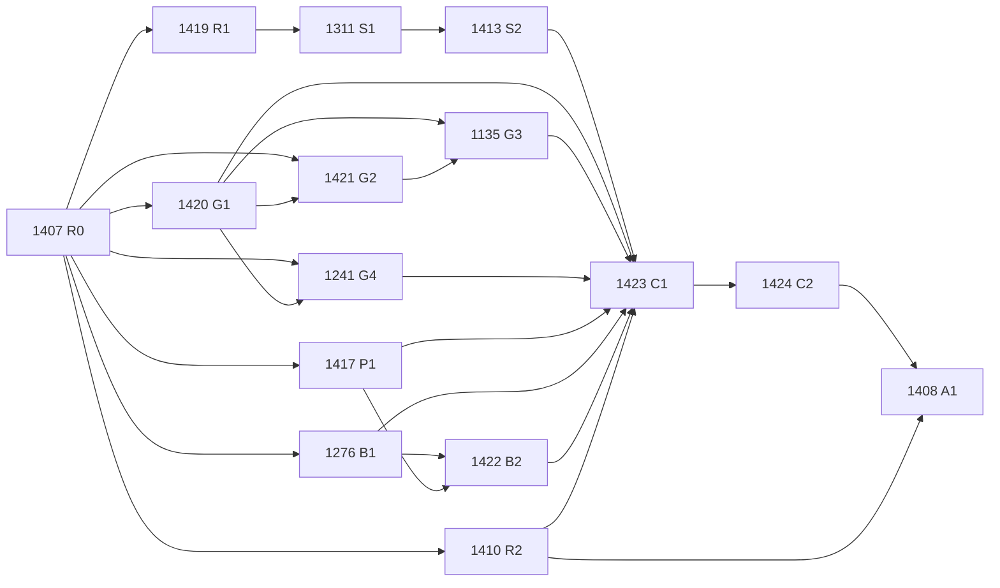

# v0.24 scope and evidence contract (#1407)

**Contract version:** 1.0.1. **Status:** FROZEN. **R0 gate:** MET.
**Recorded:** 2026-10-01. **Epic:** #1409. **Gate:** R0.

**Freeze event:** the commit that merges this document to `main`. Until that merge the
capacity ceilings in §9 are `PROPOSED — pending maintainer acceptance in PR review`, and no
downstream 0.24 gate may start.

**Lifecycle.** The packet is committed and merged as `PROPOSED` / `NOT-MET`. The first PR after
the merge is an **acceptance write-back**: amendment `1.0.1` (not after decision-bearing
inspection) that adds `acceptance {mergeCommit, mergedAtUtc, pr}` naming the R0 merge on `main`;
sets `contractVersion` `1.0.1`, `status` `FROZEN`, `gateStatus` `MET`, and capacity and every
ceiling `ACCEPTED` at the merged values; sets the inventory's `contractVersion` to `1.0.1`; updates
this document's version line, status line, and amendment log to match; and re-hashes
`sha256.json`. It changes nothing else. The merge commit is the freeze
identity; the write-back only records it. R0 is MET, and downstream gates may start, once the
write-back merges. The validator rejects every mixed state (`C008`, `C012`).

**Machine-readable packet:** `docs/plans/evidence/evidence-contract-1407/`

| File | Content |
|---|---|
| `contract.json` | Cutoff, baselines, outcome vocabulary, classifications, benchmark and provenance rules, release path, rules, authorities, capacity, children, retrospective, amendment log |
| `artifact-inventory.json` | 34 release-critical artifacts with producer, consumers, source revisions, configuration, seeds, environment, regeneration, provenance, storage, owners, classification; 7 scope exclusions |
| `sha256.json` | SHA-256 of this document, `contract.json`, and `artifact-inventory.json` over LF-normalized bytes. #1423 copies these into the candidate manifest |

**Enforced by:** `tests/Calor.Compiler.Tests/EvidenceContract/` (validator plus positive and
negative controls; §12). The tests run in the required `tests (compiler)` check.

If this document and `contract.json` disagree, `contract.json` governs and the disagreement is a
defect to fix by amendment.

## 0. Non-authorization

This contract does not authorize a product release, version bump, package publication, paid or
participant agent experiment, paid LLM benchmark run, or any new public Calor advantage,
whole-program soundness, or stronger verifier-coverage claim. It does not start any other 0.24
gate.

## 1. Cutoff

| Field | Value |
|---|---|
| Timestamp (UTC) | `2026-10-01T17:36:19Z` |
| Commit | `72a0a855d8cd7f1e85c5bcd99474b83d1556d4e1` |
| Resolved from | `refs/remotes/origin/main` after `git fetch origin` |

Work merged at or before this commit is **retrospective evidence or a control**. It cannot satisfy
confirmatory post-contract evidence by itself. The validator rejects an established row recorded
at or before the cutoff (`E007`).

## 2. Baselines

A mutable branch name is not a baseline. Each baseline is a separate recorded row; later baselines
are added rows, never silent replacements.

| Row | Role | Commit | Notes |
|---|---|---|---|
| **B1** | Primary released baseline for #1311 (maintainer decision) | `72a0a855d8cd7f1e85c5bcd99474b83d1556d4e1` | Tag `v0.22.0` (lightweight). GitHub prerelease published 2026-09-15T17:11:53Z. **No NuGet package:** publish run 34999741476 failed in `release-quality` ("performance test run failed") and `test (performance)`; the `publish` job was skipped. The website (run 34999741475) and benchmark (run 34999741525) workflows for the same release succeeded. |
| B0 | Historical pin from the original #1311 text | `74e55ce4861f9548199629ab6e18623ef1759f21` | Tag `v0.19.0`. Retained. Not investigated in 0.24 unless an amendment adds it as a second baseline. |
| **N1** | Second investigated baseline for #1311 (maintainer decision, 2026-10-01) | `88b5d38df97fd7e438882c956b9f9dcdc7a6cef5` | The newest compiler on nuget.org at the cutoff (0.21.0). Packed by `workflow_dispatch` run 34662528371 from #1449's commit, not from the `v0.21.0` tag commit `b1d23d7d74aa17a460d6a7d429836ca8396bb182` (whose release-event publish run 34658493492 failed). This is the binary users actually install. #1419 registers it as a separate sweep row; B1 and N1 results are never pooled or substituted for each other. |

**Candidate starting SHA for repairs:** `72a0a855d8cd7f1e85c5bcd99474b83d1556d4e1` (equal to the
cutoff and to B1). The post-repair candidate is frozen separately by #1423.

## 3. Artifact inventory

Full records live in `artifact-inventory.json`. Classifications:

- **authoritative** — the single canonical record a gate or public surface reads. Needs a
  regeneration command and a durable provenance identity (`git-committed`, `full-sha`,
  `content-hash`, `release-asset`, `registry-immutable`). It may carry open defects; an open
  defect blocks establishment until closed.
- **derived** — computed from inventoried inputs named in `derivedFrom`. Needs a regeneration
  command. Staleness propagates: a derived or authoritative artifact with a stale input is invalid.
- **historical-only** — a retained past record. Never regenerated in place; never establishes a
  0.24 claim.
- **stale** — known not to match its producer at the cutoff, or known not to establish what its
  name or description claims. Not consumable as evidence until repaired and regenerated.

The inventory is frozen at the cutoff. A repaired stale artifact becomes authoritative or derived
only through a versioned amendment that names the repairing PR; a classification never changes
silently (`reclassificationRule`).

| Artifact id | Kind | Class | Owning issues | Open defect at cutoff |
|---|---|---|---|---|
| `verifier-runtime-differential` | verification | authoritative | #1421, #1135 | Verdict flipped on an identical tree (#1135) |
| `modeled-forms-whitelist` | proof | authoritative | #1419, #1311, #1413 | — |
| `release-test-suites` | verification | authoritative | #1424 | — |
| `ci-test-reports` | verification | derived | #1424 | Expiring Actions artifacts |
| `test-manifest` | verification | authoritative | #1423, #1424 | Stale fetch-depth comment (#1417) |
| `z3-upstream-pins` | environment | authoritative | #1420 | Two Z3 asset provenance paths |
| `z3-release-binaries` | environment | authoritative | #1420 | — |
| `toolchain-pins` | environment | authoritative | #1421, #1423 | CI requests `10.0.x`, not an exact SDK |
| `corpus-submodules` | corpus | authoritative | #1424 | — |
| `roundtrip-reports` | corpus | derived | #1424 | Expiring Actions artifacts |
| `roundtrip-baselines` | corpus | derived | #1424 | Seeded "current state, not known-good" |
| `quality-ratchet-baselines` | verification | authoritative | #1410 | Performance step failed in the v0.22.0 publish run |
| `release-quality-reports` | verification | derived | #1410, #1424 | Failing v0.22.0 report expires with the Actions artifact |
| `sdk-consumer-check` | verification | derived | #1410, #1420, #1424 | Job conclusion only; tests a self-packed SDK with upstream-bootstrapped Z3, not the published package |
| `tier1-verification` | verification | stale | #1241 | No AST comparison; empty selection |
| `tier2-corpus-verification` | verification | stale | #1241 | 169 failures / 1,092 files, mixed causes |
| `ledger-provenance-index` | provenance | authoritative | #1417 | HEAD reachability; shallow skip |
| `benchmark-corpus` | corpus | authoritative | #1276 | Non-equivalent pairs; no pair manifest |
| `benchmark-results` | benchmark | stale | #1276, #1422 | Short SHA; pseudo-replicated intervals |
| `benchmark-provenance` | publication | stale | #1417, #1422, #1410 | Short SHA |
| `benchmark-results-md` | publication | stale | #1422 | Inherits staleness |
| `website-benchmark-pages` | publication | stale | #1410, #1408 | Inherits staleness |
| `benchmark-workflow-output` | benchmark | stale | #1422 | Refusal masked |
| `benchmark-publication-pr` | publication | stale | #1422 | PR #1226 still open |
| `llm-and-agent-results` | benchmark | historical-only | #1408 | — |
| `changelog` | publication | historical-only | #1410, #1408 | — |
| `github-release-notes` | publication | historical-only | #1410 | — |
| `nuget-packages` | publication | authoritative | #1410 | Dispatch/override can diverge from tag |
| `candidate-packages` | publication | authoritative | #1424, #1410, #1423 | — (created by #1424; unpublished, content-hashed) |
| `release-metadata` | provenance | authoritative | #1410 | None attached for v0.22.0 |
| `website-deployment` | publication | stale | #1410, #1408 | Ungated; publishes stale surfaces |
| `v019-audit-disposition` | proof | historical-only | #1419 | — |
| `pre-cut-evidence-packets` | verification | historical-only | #1408 | — |
| `evidence-contract` | provenance | authoritative | #1407 | — |

Excluded from scope before any decision-bearing inspection (with reasons in the JSON):
`bench/phase0-agent-native/epochs/`, `bench/conversion-results/`, `bench/real-scale/`,
`bench/ILAnalysisBench`, `bench/IncrementalBuildBench`, `bench/mcp`, `benchmarks/`, the
conversion scorecard (the `test.yml` artifact and its copy inside `release-quality-reports`), and
the nightly performance-report artifact.

`release-test-suites` covers all 13 projects marked `releaseCritical` in `eng/test-manifest.json`.

## 4. Proof outcome vocabulary

Grounded in `src/Calor.Compiler/Verification/ProofOutcome.cs` (the single status-assigning
function `ProofOutcome.Assign` and the legacy mappings), `Z3/Z3ImplicationProver.cs`,
`VerificationResult.cs`, `Obligations/ObligationTracker.cs`, and the elision sites in
`CodeGen/CSharpEmitter.cs`. A test asserts every member of `ProofStatus`,
`ContractVerificationStatus`, `ObligationStatus`, `ImplicationStatus`, and `KInductionStatus` is
named by at least one token below, so no emitted status is unclassified. The legacy enums are
lossy: `ContractVerificationStatus.Unproven`, `ObligationStatus.Timeout`, and
`ImplicationStatus.Unknown` each receive both `Assumed` and `TimeoutOrUnavailable`, so a legacy
value can appear under two tokens. Producers classify from `ProofOutcome`, never from a legacy
value. `KInductionStatus` has one production path: with
`VerificationAnalysisOptions.EnableKInduction` (off by default, on in `Thorough`),
`VerificationAnalysisPass` runs `LoopAnalysisRunner` and a proven loop invariant becomes a
`Calor0950` info diagnostic. That path removes no runtime guard.

| Token | Code statuses | May remove a runtime guard | May establish a release claim |
|---|---|---|---|
| `Proven` | `ProofStatus.Proven` with `IsVacuous = false`; `ContractVerificationStatus.Proven`; `ImplicationStatus.Proven` | Yes (postconditions, when `ElideProvenGuards`) | Yes, only under the conditions below |
| `ProvenVacuous` | `ProofStatus.Proven` with `IsVacuous = true`; `Calor0719` | No (emitter keeps the guard) | No |
| `Discharged` | `ObligationStatus.Discharged` | Yes (when `ElideProvenGuards` and the `ObligationPolicy` action needs no guard) | Yes, only under the conditions below plus a registered non-vacuity check |
| `Assumed` | `ProofStatus.Assumed` → `Unproven` / `ObligationStatus.Timeout` / `ImplicationStatus.Unknown` | No | No |
| `Unsupported` | `ProofStatus.Unsupported` and the three legacy `Unsupported` | No | No (validates a registered refusal row only) |
| `TimeoutOrUnavailable` | `ProofStatus.Timeout`, `Unknown`, `Unavailable`; `Unproven`; `Skipped`; `ObligationStatus.Timeout`, `Pending`; `ImplicationStatus.Unknown`; `Calor0710` | No | No |
| `Failed` | `ProofStatus.Refuted`; `Disproven`; `ObligationStatus.Failed`; `ImplicationStatus.Disproven` | No | No positive claim |
| `Boundary` | `ObligationStatus.Boundary` | No | No |

`Proven` and `Discharged` establish a claim only when **all** hold:

1. produced on the frozen #1423 candidate by a registered producer;
2. the modeled form has no unresolved false unconditional proof under #1413;
3. an independent behavioral oracle agrees (#1311); the verifier's own simplifier or translator is
   never the sole oracle;
4. `TranslatorSemanticsVersion` equals the candidate's `ContractTranslator.SemanticsVersion`
   (`z3-executable-semantics-v2` at the cutoff); cache entries from another version are not
   evidence;
5. non-vacuous. For `Discharged` this needs an explicit check: `ObligationSolver` never assigns
   `ProofEvidence.VacuousProof`, so the obligation channel carries no vacuity flag. #1419 must
   register a non-vacuity check for every `Discharged` row it counts. This is a registration
   requirement, **not a finding**; no sweep was executed for this document.

An established row carries the evidence for these conditions itself; an absent field is a
violation, never a default (`contract.json` `establishedRowFields`): `registrationId`, `producer`,
`oracle {id, agrees: true}`, `translatorSemanticsVersion` equal to the candidate's,
`unresolvedFalseProof: false`, `nonVacuityCheck {id, result: "passed"}` for `Discharged`, and
`openDefectsResolvedBy` naming one merged PR per open defect the inventory records for the cited
artifact (`E003`, `E013`, `E014`).

`ObligationStatus.Timeout` is a legacy bucket that also receives `Assumed` and `Unavailable`.
Consumers read `ProofOutcome`, not the legacy enum, to tell them apart.

**Non-outcome row statuses** — `skipped`, `flaky`, `crashed`, `invalid`, `not-investigated`,
`unclassified`, `incomparable`, `historical`, `stale` — are never established. An unknown token is
a validation error; it is never mapped to the nearest known status (`E001`). Raw code names such as
`Refuted` or `Timeout` must be mapped to a frozen token by the producer.

**False unconditional proof.** A row whose outcome is `Proven` or `Discharged` (non-vacuous) while
an independent oracle exhibits a concrete modeled input that violates the claimed property. It is
release-blocking for the affected modeled form until fixed or visibly demoted. A retained runtime
guard does not make it acceptable. Changed behavior alone is not a false proof, and `Assumed`,
`Unsupported`, or `TimeoutOrUnavailable` is not an unconditional proof.

## 5. Benchmark equivalence and sampling unit

Frozen before #1276 repairs or recomputes anything.

**Registration first.** Before #1276 repairs any pair, executes any differential check, or
recomputes any metric, it merges a versioned benchmark registration. The registration pins the
complete initial pair denominator (every pair at the cutoff, by path and SHA-256); each pair's task
statement, input set, expected outputs, and failure behavior; the differential oracle and its
command; the metric set and metric implementation version; the aggregation and interval method;
and every pre-registered exclusion with its reason. Dispositions are assigned only after that
merge, by running the registered oracle. A later change to a pinned field is a #1407 amendment. A
pair dropped or re-dispositioned after registration stays reported with its previous disposition.

**Pair row.** Every pair in the #1276 manifest records `pairId`, both paths and SHA-256 hashes,
the task-statement hash, input set, expected outputs, failure behavior, disposition, equivalence
evidence, and reviewer.

**Equivalence.** Both sides implement the same task statement, accept the same inputs, produce the
same outputs, and fail on the same inputs in the same observable way. Evidence is an executed
differential check, not inspection of names. Known witness: `DomainProblems/CsvParser` at
`3a452b094bc53086adc25bf51ac7787eb4986fc3` (#1276).

**Dispositions.** `EQUIVALENT`, `NOT-EQUIVALENT`, `UNCLASSIFIED`, `EXCLUDED-PRE-REGISTERED`.
Only `EQUIVALENT` pairs enter comparative metrics. An included `UNCLASSIFIED` pair blocks headline
generation. Excluded pairs are counted in the published denominator, never dropped. A pair whose
either side fails to parse or compile is `NOT-EQUIVALENT` unless its registered failure behavior
says otherwise.

**Comparability key.** `pairManifestSha256`, `metricSetSha256`, `metricImplementationVersion`,
`aggregationMethod`, `samplingUnit`, `runCount`, `generatorVersion`, `exclusionsSha256`. Two
results are comparable only if every field is equal. Otherwise no delta, ratio change, or
advantage movement is printed; the result is labeled incomparable; and the method change needs a
previously merged #1407 amendment — never a workflow input such as `allow_weaker_methodology`.

**Sampling unit: the program pair.** Repeated runs of a deterministic calculator are a determinism
check (all runs must agree), not samples. Uncertainty is computed only by resampling over
independent program pairs. A category with fewer than 2 included pairs reports no interval. The
corpus is a fixed, non-random set, so any interval describes resampling sensitivity of this corpus
only and is labeled so.

**Claims.** Static feature scores are not coding-agent outcomes. Neither is presented as a measured
language, productivity, correctness, or safety advantage.

## 6. Durable provenance identity

#1417 implements this design.

An identity is `{commit, resolvedVia, treeHashes, inputContentHashes}`.

- **commit** — a full 40-hex SHA that is an ancestor of explicitly fetched
  `refs/remotes/origin/main` or the target of an immutable release tag. `HEAD`, a
  `refs/pull/N/merge` ref, a branch, a short SHA, or an object only present in one clone is
  rejected.
- **treeHashes / inputContentHashes** — the claimed source, corpus, configuration, and
  generated-input identities, verified by `git rev-parse <commit>:<path>` and SHA-256 of manifests.
  Reachability alone is insufficient.
- **Squash merge.** When the final commit cannot exist before merge, either (a) merge with a merge
  commit that keeps the measured commit as an ancestor of `main` (the repository already does this
  for several ledgers), or (b) record a pending phase-1 identity (PR head SHA plus tree hashes) and
  complete it with a post-merge write-back that records the `main` commit and re-verifies tree
  equality. A phase-1 identity is never authoritative.
- **Shallow clones.** Authoritative validation fails, not skips, in a shallow or unfetched clone.
  Producers fetch the bounded history and tags they need.
- **History.** Existing `measuredCommit` stamps stay unchanged. Durable identities are recorded
  beside them (the `commit-stamp-index.json` pattern), never over them.

## 7. Release-path inventory

As found at the cutoff. No surface consumes an adjudication identity today (`consumesAdjudication:
false` for every row in `contract.json`).

| Surface | Trigger | Producer | Gate before it |
|---|---|---|---|
| Release PR | Manual (`.claude/skills/create-release/SKILL.md` steps 1-5) | Developer machine; benchmark JSON generated locally with `dotnet run --project tests/Calor.Evaluation -c Release -- run --statistical --runs 30`; PR squash-merged | Required checks on `main` |
| GitHub release | Manual `gh release create vX.Y.Z --notes-file` | Maintainer; notes = awk extract of the CHANGELOG section | **None.** Creation comes first and triggers everything below |
| NuGet packages | `release: created`, or `workflow_dispatch` with a version override | `publish-nuget.yml` `publish` (needs `test` matrix, `sdk-consumer`, `release-quality`) | In-workflow jobs; `--skip-duplicate` |
| SBOM / provenance | `publish` job | `scripts/generate-release-metadata.py`; `attest-build-provenance@v2`; `gh release upload --clobber` | `publish` job |
| Website | `release: created`, or `workflow_dispatch` | `nextjs-gh-pages.yml` | **None** in the workflow; `github-pages` environment has a branch policy only |
| Benchmark publication | `release: created`; push to `main` on benchmark paths; `workflow_dispatch` | `benchmark.yml` → bot PR on `benchmark-results-update` | Methodology check whose exit status is masked (§11, #1157) |
| Agent refactoring data | `workflow_dispatch` with `agent_refactoring=true` | `benchmark.yml` `agent-refactoring-benchmark` | **None**; pushes to `main` with `[skip ci]` |
| Installed-tool check | `workflow_dispatch` | `verify-release.yml` | Manual, after publication |

**Regeneration never publishes.** #1424 regenerates publication surfaces only as unpublished
candidates with content hashes: `candidate-packages` (packed, not pushed), release metadata
generated from them, the website built but not deployed, and release notes rendered but not
posted. Registry push, GitHub release creation, release-asset upload, and Pages deployment are
publication. They happen only after #1408 records `MILESTONE-SUCCEEDED`, through the #1410 gate,
and consume the exact adjudicated hashes. `nuget-packages` is never regenerated by #1424. Pinned
inputs (`z3-release-binaries`, `z3-upstream-pins`, `toolchain-pins`, `corpus-submodules`) are
re-materialized and checksum-verified, never rebuilt or republished. No regeneration command may
run a workflow that pushes packages, creates or edits a release, uploads release assets, opens a
publication PR, commits to `main`, or deploys. Uploading Actions artifacts to retain evidence is
not publication.

**Observed consequences.** The v0.22.0 GitHub release and website went public while its NuGet
publish failed, so no 0.22.0 package exists. NuGet 0.21.0 was built from a commit other than its
release tag. Both follow from release creation preceding every gate; #1410 owns the repair.

**Required status checks on `main`** (branch protection, enforcement level `non_admins`, so admins
can bypass): `test`, `calor-first-guard`, `d-s1.5-fixtures`, `tests (compiler)`,
`tests (enforcement)`. Not required: `tests (verification)` (which carries the #1135 oracle and is
release-critical in `eng/test-manifest.json`), `tests (conversion)`, `roundtrip-verification`,
`quality-ratchets`, `verify-phase1`, the SDK and CLI consumer matrices, `annex-freeze`,
`tamper-check`, and the website regression jobs.

**Retention.** Actions artifacts: 14, 30, or 90 days per upload step — never authoritative.
Release assets: durable but mutable (`--clobber`). NuGet versions: immutable (unlist only). Pages:
replaced by the next deployment. Committed files: durable when reachable from protected `main` or
an immutable tag.

## 8. Failure, amendment, and stopping rules

- **False proofs.** A concrete false unconditional proof is release-blocking for the affected
  modeled form until fixed or visibly demoted. A retained guard does not cure it.
- **Missingness.** Unknown, unsupported, unavailable, skipped, timed-out, flaky, stale, invalid,
  historical, incomparable, and uninvestigated rows are not established.
- **History.** Corrected published artifacts stay as historical records. They are not rewritten
  to look as if the repaired method produced them.
- **Amendments.** Any scope or rule change after decision-bearing inspection is a versioned
  amendment entry (version, UTC timestamp, justification, reviewed PR, whether it follows
  decision-bearing inspection) and bumps `contractVersion`. It cannot remove a failing row; a
  removed row stays reported with its last status. The validator enforces these fields (`C010`) and
  `sha256.json` changes with every edit.
- **Discovery.** Discovery may create bounded repair issues within §9 capacity. Every finding is
  fixed, visibly demoted, excluded by this pre-registered scope, or makes the milestone fail. It
  never becomes ordinary follow-up while 0.24 is reported as successful.
- **Retrospective work.** Pre-cut fixes are controls and cannot satisfy confirmatory evidence by
  themselves.

Vocabularies frozen for later gates: finding dispositions (#1413) `VALIDATED`, `FIX-IN-0.24`,
`DEMOTE-IN-0.24`, `NOT-INVESTIGATED`, `MILESTONE-FAILED`; adjudication outcomes (#1408)
`SUPPORTED`, `BOUNDED`, `HISTORICAL-ONLY`, `BLOCKED`; terminal outcomes `MILESTONE-SUCCEEDED`,
`MILESTONE-FAILED`.

**Stopping conditions.**

1. A §9 ceiling is reached: stop the gate, record the overrun, and either merge a reviewed
   amendment raising the ceiling before more work or record the gate `BLOCKED`.
2. #1311 reaches its timebox: stop and publish the report. Unreached rows are `not-investigated`;
   an unreached row registered by #1419 as release-critical is `BLOCKED`.
3. A false unconditional proof cannot be fixed or demoted within capacity: `MILESTONE-FAILED`.
4. The frozen candidate changes after #1423: all downstream evidence is invalid; return to #1423.
5. Adjudication as defined in §9 (the named adjudicator under the recorded independence
   deviation) is unavailable: `MILESTONE-FAILED` or a self-adjudicated non-release record.

**Terminal success predicate.** #1408 records `MILESTONE-SUCCEEDED` only when every condition
holds; otherwise it records `MILESTONE-FAILED`. #1408 does not add, drop, or weaken a condition; a
change is a #1407 amendment made before the #1424 raw-artifact freeze.

1. Every child other than #1408 is closed with its closure evidence (§10).
2. Every #1419-registered release-critical row, for B1 and for N1, has an outcome or row status,
   and none is `BLOCKED`, `not-investigated`, or `unclassified`.
3. No #1408 adjudication row for any release-critical artifact, gate, or claim is `BLOCKED`.
   Required evidence that is missing, inconclusive, stale, or incomparable makes its row `BLOCKED`,
   never `HISTORICAL-ONLY` or `BOUNDED` (`T001`).
4. Zero unresolved false unconditional proofs; each is fixed or visibly demoted under #1413.
5. Every #1413 finding has a disposition other than `NOT-INVESTIGATED` or `MILESTONE-FAILED`.
6. Every authoritative and derived inventory artifact was regenerated by #1424 on the frozen #1423
   candidate, with no stale input (publication surfaces as unpublished candidates, §7).
7. Every release surface in §7 consumes one matching adjudication identity (#1410 negative tests
   pass).
8. Every adjudication row records `independence = reduced-maintainer-adjudicated`, and no row is
   `SUPPORTED` while the deviation stands (`T002`).
9. No §9 ceiling was exceeded without a merged amendment raising it.

**Required subjects.** The terminal record adjudicates every subject exactly once: every artifact
in the (amended) inventory, one `gate:#<issue>` row per child other than #1408, and one
`claim:<id>` row per registered claim. At the raw-artifact freeze, #1424 commits the claim registry
(every public or release claim the milestone intends to make); #1408 cannot add, drop, or rename a
claim. Every subject is release-critical; the contract fixes criticality, not the record.
`HISTORICAL-ONLY` is valid only for an artifact the inventory classifies historical-only, and an
artifact still classified stale can only be `BLOCKED`. A missing subject fails success (`T001`); a
duplicate, unknown, or unregistered subject, an improper `HISTORICAL-ONLY`, or a non-`BLOCKED`
stale artifact is malformed (`T003`).

Under the deviation, a `MILESTONE-SUCCEEDED` record carries `adjudicationIndependence = reduced`,
`limitation` equal to the published limitation in §9, and `epicIndependentAdjudicationMet = false`
(`T002`), and states that the epic's "independently adjudicated" outcome is not met. It authorizes no claim
of independent adjudication or verification.

## 9. Authorities, owners, independence, and capacity

| Role | Holder |
|---|---|
| Decision authority | @juanmicrosoft |
| Amendment authority | @juanmicrosoft |
| Implementation owners | Claude Code agents; one branch and one PR per issue; agents never merge |
| Review and merge | @juanmicrosoft reviews and merges every PR |
| Independent review owner / adjudicator (#1408) | @juanmicrosoft — **documented deviation** |

### Independence deviation

Epic rule 10 and #1408 require that the adjudicator did not implement the producer or repair, does
not change #1407 rules, and is backed by an independent approving review. @juanmicrosoft did not
write the repairs — agents did — but the maintainer directs, reviews, and merges them, and also holds
decision and amendment authority. **Independence is reduced.** This is recorded as a deviation,
not as compliance.

Consequences for every 0.24 claim:

1. Every adjudication row records `independence = reduced-maintainer-adjudicated`.
2. **No row may be `SUPPORTED`.** The maximum is `BOUNDED`, with the published limitation
   "adjudicated by the maintainer who directed and merged the repairs; not independently
   adjudicated". This follows #1408's own rule for unavailable independent review. The validator
   rejects `SUPPORTED` while the deviation stands (`E011`).
3. A `MILESTONE-SUCCEEDED` record must carry `adjudicationIndependence = reduced`. No public surface
   may call 0.24 evidence "independently adjudicated" or "independently verified". The epic's
   outcome sentence ("independently adjudicated") is therefore **not** met under this deviation.
4. From the #1424 raw-artifact freeze until #1408 closes, amendment authority is not exercised. An
   amendment in that window invalidates the affected evidence and returns to #1423.

**Amendable.** A versioned amendment may name an independent reviewer who neither implemented,
directed, nor merged the producer or repair. It lifts the cap only for rows that reviewer
adjudicates after the amendment; earlier rows are re-adjudicated, not relabeled.

### Capacity ceilings

**PROPOSED — pending maintainer acceptance in PR review.** The maintainer gave no numbers. These are
conservative proposals. They become accepted only when the maintainer merges this contract;
R0 is not MET before that.

| Ceiling | Proposed value |
|---|---|
| Milestone timebox | 56 calendar days from the R0 merge |
| Maintainer review, total | 40 hours across the milestone |
| Maintainer review, per PR | 2 hours, all rounds |
| Review rounds per PR | 3; then the PR is closed and re-scoped |
| Agent PRs per gate issue | 2 (one primary, one follow-up) |
| PR size | 1,500 changed lines, excluding committed evidence data and test fixtures |
| #1413 accepted repairs/demotions | 6 PRs in total, each at most 600 changed non-test lines |
| #1311 timebox | 10 calendar days from the #1419 merge |
| #1311 agent execution | 20 hours |
| #1311 generated cases | 1,500 beyond the existing 1,170-cell differential controls |
| #1311 compute | 600 CI runner-minutes plus at most 10 local machine-hours |
| #1421/#1135 repeated runs | 2,000 CI runner-minutes |
| #1424 regeneration | 1,500 CI runner-minutes per complete run; at most 2 complete runs |
| Ordinary PR CI | 15,000 CI runner-minutes across the milestone |
| Paid compute or API spend | 0 USD |

The ordinary-CI ceiling assumes about 250 runner-minutes per full `test.yml` push. That figure is
an unmeasured estimate.

## 10. Dependency graph

GitHub sub-issue and blocked-by relationships govern; this table mirrors them at the cutoff.
Every child names the frozen sections it consumes and its closure evidence (validated by `C005`
to `C007`).

| Gate | Issue | Depends on | Consumes (frozen sections) | Closure evidence |
|---|---|---|---|---|
| R1 | #1419 | #1407 | cutoff, baselines, outcome vocabulary, authority/capacity, rules, retrospective | Merged registration and a full row manifest for each investigated baseline, B1 and N1 as separate never-pooled rows (entry points, case IDs, hashes, oracle, controls, row classes, release-critical marks) before any decision-bearing result |
| S1 | #1311 | #1419 | baselines, outcome vocabulary, capacity, rules | Every registered B1 and N1 row executed or `not-investigated` within §9 (the S1 ceilings cover the combined B1 and N1 work); archived probes, oracle results, controls, reproducible report |
| S2 | #1413 | #1311 | outcome vocabulary, rules, capacity | One reviewed disposition per row and witness; repairs within §9, attached to #1409 and blocking #1423 |
| G1 | #1420 | #1407 | inventory, retrospective | Consumer/RID inventory; no unowned seeding; no implicit download; fresh-checkout discriminating tests |
| G2 | #1421 | #1407, #1420 | outcome vocabulary, capacity, rules | Machine-readable protocol merged before decision-bearing runs, within the determinism ceiling |
| G3 | #1135 | #1420, #1421 | outcome vocabulary, inventory | Repaired oracle run under #1421; all attempts retained; agreement under the frozen rule |
| G4 | #1241 | #1407, #1420 | inventory, outcome vocabulary | Checkout-pinned Tier 2 with explicit fixture expectations; truthful AST-roundtrip claim; negative self-tests |
| P1 | #1417 | #1407 | provenance identity, inventory, retrospective | Fresh-clone resolution after squash merge; failing tests for branch-only, false identical-tree, and shallow-skip cases |
| B1 | #1276 | #1407 | benchmark equivalence, inventory, retrospective | §5 benchmark registration merged before any repair, differential check, or recomputation; then a content-addressed pair manifest with §5 fields and an oracle-produced disposition for every registered pair; declared sampling unit and population |
| B2 | #1422 | #1276, #1417 | benchmark equivalence, provenance, release path, retrospective | End-to-end tests: refusal fails and leaves no PR; unclassified/changed pairs block headlines; method change only by amendment |
| R2 | #1410 | #1407 | release path, provenance, authority/capacity | Negative tests: no release surface proceeds without one matching adjudication identity; release created after adjudication |
| C1 | #1423 | #1413, #1420, #1135, #1241, #1417, #1276, #1422, #1410 (+ every #1413 repair) | inventory, provenance, rules | Committed candidate manifest including `sha256.json` values and the amendment log; tested invalidation classifier |
| C2 | #1424 | #1423 | inventory, outcome vocabulary, capacity | Every authoritative and derived artifact regenerated on the candidate (publication surfaces only as unpublished candidates; #1424 publishes nothing); all attempts in durable storage; fresh-clone reproduction |
| A1 | #1408 | #1424, #1410 | outcome vocabulary, authority/capacity, rules, benchmark equivalence, release path | One outcome per artifact and claim, capped at `BOUNDED` under §9; machine-readable terminal record |

Downstream of 0.24 (out of scope): #1423 also blocks the 0.25 issues #1144, #1132, #1139, #847,
#906, #943, and #1428; #1413 blocks #1426; #1408 blocks #1430.

## 11. Retrospective status

Pre-cut items. None counts as a prospective 0.24 accomplishment. Residuals were determined by
reading the code and workflows at the cutoff, not copied from the epic.

| Item | Pre-cut repair | Issue state | Precise residual retained in 0.24 | Owner |
|---|---|---|---|---|
| #845 | PR #961, merge `e8bb373150f7ccdf303740d24af0180ada8e9220` (2026-08-12) | OPEN | `ContractTranslator` now maps unsigned literals through `UnsignedValue` to unsigned bit-vectors and applies C# promotions; `NumericExecutableSemanticsTests` covers u64 `0`, `1`, `ulong.MaxValue`. Residual: #845 is not closed and its named regression (a `ULONG:` contract bound near `ulong.MaxValue` that proves when satisfiable and refutes when violated) is not identified as a closing test. `ExpressionSimplifier` folds unary `Negate` and `BitwiseNot` over `IntLiteralNode` without checking `IsUnsigned` or `IsLong`; whether that can reach an established proof was **not executed**, to keep R1 preregistered. Role: discriminating control for R1/S1 (pre-fix parent `17d253dff964e37538a5f503d3744b576bd2fb52`). | #1419 |
| #859 | None; superseded by the explicit-bootstrap rule | OPEN | Builds are network-free and `ValidateZ3Assets` fails on missing assets (proven by the `test` job step "Missing Z3 fails before compilation without downloading"). Residual: native propagation still uses the evaluation-time `runtimes\**\*` glob plus the `AfterTargets="Build"` `CopyZ3NativeToOutput` side copy that #859 suspected of racing; each workflow bootstraps separately (9 of 12 workflow files); the developer bootstrap (upstream archives, `z3-upstream-4.15.7.sha256`) and the publish job (`z3-binaries-4.15.7` release, `.github/z3-binaries-4.15.7.sha256`) are two provenance paths; no RID consumer matrix proves zero silent Z3 skips for every consumer. #859's MSBuild-time download is rejected. | #1420 |
| #1157 | PR #1199, merge `9e2bddecae7b0090b373f06e91afa228b8ca3af9` (2026-09-08) | OPEN | `check-benchmark-methodology.js` and gate-16 tests exist; defect 1 did not reproduce. Residual: `benchmark.yml` pipes the checker through `tee` in a step using the default shell (`bash -e`, no `pipefail`), so a refusal does not fail the step — run 34473057220 (push, `efbd891a`, 2026-09-10) succeeded; PR #1226 is still open at the cutoff; `allow_weaker_methodology` is an unchecked workflow input; release events also open publication PRs; the agent-refactoring job pushes to `main` directly and writes `passRate: 0` when extraction fails; no pair manifest is consumed. | #1422 |
| #1159 | PR #1199 (same merge) | OPEN | `commit-stamp-index.json` and `LedgerCommitStampTests` exist. Residual: reachability is tested against `HEAD` (a pull-request merge ref in PR CI), not fetched protected `main` or a tag; a shallow clone skips instead of failing; the `identical-src-tree` basis is asserted in JSON but not verified by the test; `eng/test-manifest.json` says the `test` job runs at fetch-depth 0 and the shards stay shallow, while `test.yml` does the reverse; `benchmark-provenance.json` and `benchmark-results.json` carry the short SHA `c2a8816d`; there is no post-merge write-back. | #1417 |

## 12. Validator and negative controls

`tests/Calor.Compiler.Tests/EvidenceContract/EvidenceContractValidator.cs` is a small,
test-side validator; `EvidenceContractTests.cs` holds the controls. Positive controls: the
committed contract and inventory validate clean, the packet hashes match and cover the three
packet files by name, the vocabulary covers every verifier status enum, the committed lifecycle
state is consistent, and a well-formed established row, comparable benchmark row, historical
benchmark row, amendment, acceptance write-back (contract and inventory together), success record,
and failure record pass. Each negative control changes one fact and asserts its specific code.
It also asserts that no other code fired, except a co-firing code the test names with its reason
(for example, a short SHA is also not the candidate), so a control cannot pass because an
unrelated rule fired. Proposed-state controls build their fixture from an in-memory proposed
packet, and lifecycle checks accept either committed state, so the acceptance write-back needs no
test change; the suite was run against a simulated write-back packet before this record.

| Code | Fails closed when |
|---|---|
| `C001`–`C002` | Cutoff, baseline, or candidate commit is not a full SHA; timestamp not UTC |
| `C003`–`C004` | Outcome set differs from the frozen set; a non-establishing outcome may remove guards or establish claims |
| `C005`–`C007` | A child lacks consumed sections or closure evidence; unknown section; missing child; dependency cycle or unknown dependency |
| `C008` | R0 marked MET while the contract or any capacity ceiling is PROPOSED |
| `C009` | Authority unnamed; independence deviation without a `BOUNDED` cap or consequences |
| `C010` | Amendment without version, timestamp, justification, PR, or boolean inspection flag; version not a `MAJOR.MINOR.PATCH` strictly greater than the previous one (starting from `1.0.0`); removed row without its last status; `contractVersion` not equal to the latest amendment |
| `C011` | Ceiling without value, unit, or status |
| `C012` | Status other than `PROPOSED` or `FROZEN`; `PROPOSED` with an acceptance record or any ceiling not `PROPOSED`; `FROZEN` without `MET`, without every ceiling `ACCEPTED`, or without a complete acceptance record (full merge SHA, UTC time, PR) |
| `H001` | `sha256.json` does not cover the document, `contract.json`, and the inventory by name |
| `I001`–`I003` | Missing required field; unknown classification; duplicate id |
| `I004`–`I005` | Authoritative/derived without a regeneration command; stale/historical without command or note |
| `I006`–`I007` | Missing or unknown provenance; authoritative with a non-durable identity or Actions-only storage |
| `I008`–`I010` | Derived without inputs; unknown input; consuming a stale input without being stale |
| `I011`–`I012` | Owner not a 0.24 issue; inventory from another cutoff or contract version |
| `E001` | Unknown outcome or `counted` token (no nearest-match mapping) |
| `E002`–`E003` | `Assumed`, timeout/unavailable, unsupported, failed, boundary, vacuous, or any row status counted as established; `Discharged` without a `nonVacuityCheck {id, result: "passed"}` |
| `E004`–`E005` | An established row, or a decision-bearing benchmark row (any benchmark row not recorded `historical`), cites an unknown, stale, historical-only, or derived artifact |
| `E006`–`E007`, `E012` | Same rows: no frozen candidate, a different commit, or a row recorded at or before the cutoff; any row: a short SHA |
| `E008`–`E010` | Comparability key missing a field (on every benchmark row), a `*Sha256` field that is not 64 hex digits, or a field differing from the compared result; empty pair denominator; pair missing a §5 field, with a field of the wrong JSON type (`pairRowTypeRule`), with a malformed `*Sha256` field, or without a boolean `included`; included non-`EQUIVALENT` pair; sampling unit other than `program-pair`, in the row or in its comparability key |
| `E011` | `SUPPORTED` under the independence deviation; unknown adjudication outcome |
| `E013` | Established row without registration, producer, agreeing independent oracle, matching translator semantics version (or the candidate's is unknown), or explicit `unresolvedFalseProof: false` |
| `E014` | An established or decision-bearing benchmark row cites an artifact with open defects at the cutoff without naming a resolving PR for each |
| `T001` | A `MILESTONE-SUCCEEDED` terminal record missing a required subject (inventory artifact, child gate, or registered claim), or with any `BLOCKED` row (record-supplied criticality is ignored) |
| `T002` | A success record under the deviation without `adjudicationIndependence = reduced`, the verbatim published limitation, or `epicIndependentAdjudicationMet = false`; with a `SUPPORTED` row; or with a row not recording `reduced-maintainer-adjudicated` |
| `T003` | Unknown terminal or adjudication outcome; unknown, unregistered, or duplicate subject; `HISTORICAL-ONLY` for an artifact not classified historical-only; a stale artifact adjudicated other than `BLOCKED` |

The validator is deliberately not a framework: later gates pass their rows to
`ValidateEvidenceRows` with the #1423 candidate SHA and that candidate's
`ContractTranslator.SemanticsVersion`, #1408 passes its terminal record to
`ValidateTerminalRecord`, or a gate extends the validator by amendment. The validator checks that the
evidence is present and consistent; it does not re-run the oracle or resolve the cited PRs, which
the owning gate's review does.

## 13. Open questions for the maintainer

1. **Capacity.** Accept, change, or reject each §9 ceiling in review. Merging accepts them as
   written.
2. **Independence cap.** §9 caps every row at `BOUNDED` and states that the epic's "independently
   adjudicated" success sentence is not met. If you intended the deviation to permit `SUPPORTED`,
   that needs an explicit decision here; the conservative reading follows #1408's own text.
3. **NuGet baseline.** Decided 2026-10-01: #1419 registers N1 as a second investigated baseline
   alongside B1 (§2).

## Amendment log

Version 1.0.0 is the initial registration.

| Version | Date (UTC) | PR | After decision-bearing inspection | Change |
|---|---|---|---|---|
| 1.0.1 | 2026-10-02T13:10:12Z | #PRNUM | No | Acceptance write-back. Records the R0 merge `669e535c8a9dac967a73c70b28f9f2d0bcf84c80` (PR #1466, merged 2026-10-02T13:10:12Z) as the freeze identity; status FROZEN, R0 MET, capacity and every ceiling ACCEPTED at the merged values. Nothing else changes. |
